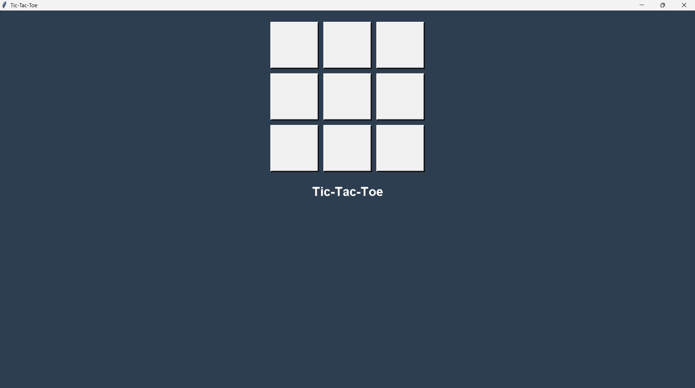
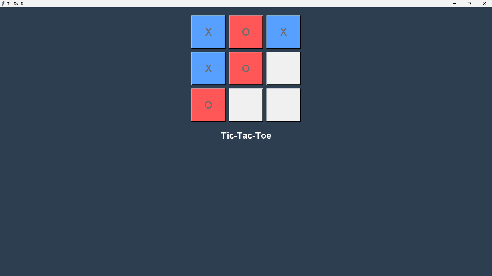
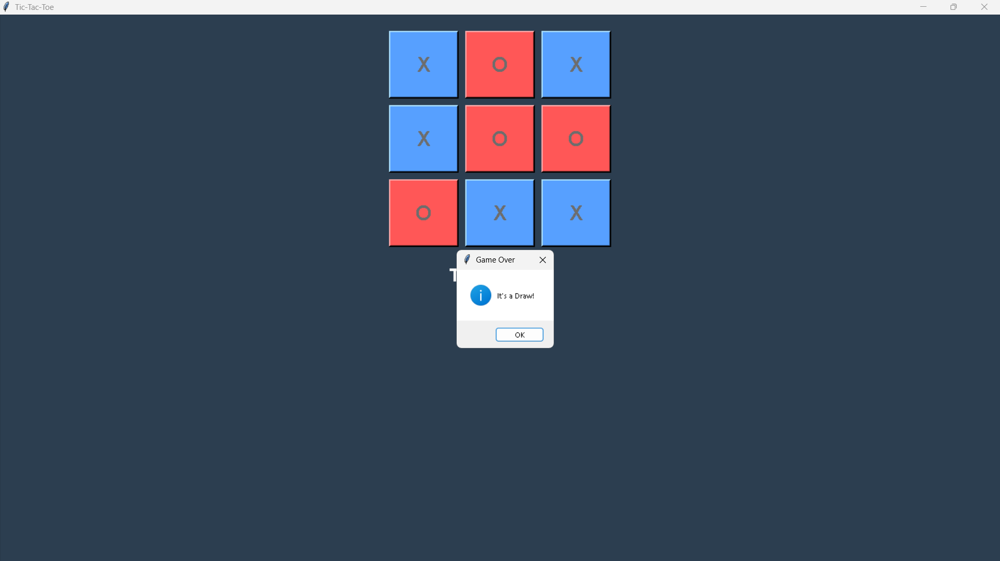
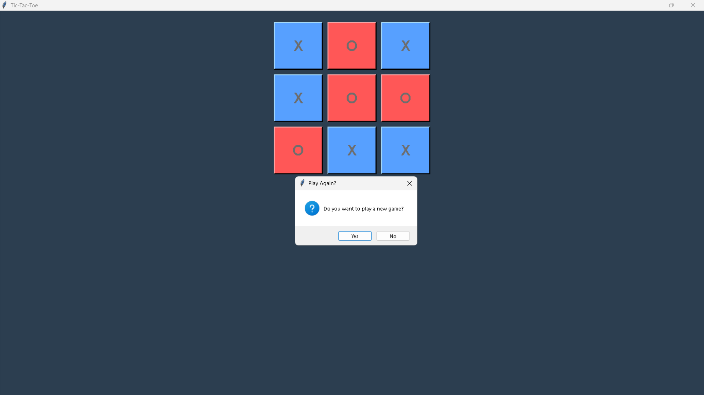

# 🕹️ Tic-Tac-Toe with AI (Minimax Algorithm)

This is a **Tic-Tac-Toe game** built with **Python** and **Tkinter**, featuring an AI opponent that uses the **Minimax algorithm with Alpha-Beta pruning**. The game offers a fun and challenging experience against the AI, which makes optimal moves based on the current board state.

---

## 🚀 **Features**
- 🎯 **AI Opponent:** The AI uses the Minimax algorithm with Alpha-Beta pruning, making intelligent and strategic moves.
- 🛠️ **GUI Interface:** Built using Tkinter, providing an interactive and user-friendly game board.
- 🔥 **Dynamic Gameplay:** Includes game result pop-ups and the option to restart the game.
- 💡 **Smart AI Decisions:** The AI evaluates board positions and chooses optimal moves to win or draw.

---

## ⚠️ **Known Lag Issue**
- The **AI thinking process can introduce slight lag**, especially when making its move.
- This occurs due to the **complexity of Minimax** calculations, particularly as the game progresses.
- **Lag Behavior:** 
    - If you click or move the Tkinter window while the AI is thinking, the game may occasionally run faster or respond unexpectedly.
    - This is due to how Tkinter handles event loops and rendering.

✅ *Tip:* Be patient when the AI is making its move—it is calculating the best possible outcome. 

---

## 🛠️ **Tech Stack**
- **Programming Language:** Python
- **GUI Library:** Tkinter
- **Algorithm:** Minimax with Alpha-Beta Pruning

---

## 🖥️ Screenshots

---

## 🤝 Contributing
Contributions are welcome! If you have any ideas or bug fixes, feel free to create a pull request.